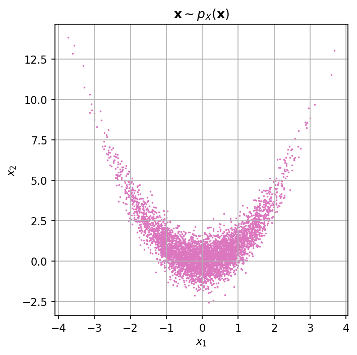

# Rosenbrock distribution

This repository implements the [Rosenbrock distribution](https://arxiv.org/pdf/1903.09556.pdf), including unnormalized density and analytic sampler


## Installation

You can install the package via:

```bash
git clone https://github.gatech.edu/asiahkoohi3/rosenbrock
cd rosenbrock
pip install -e .
```

## Example

For samples from a 2D Rosenbrock distribution, run:

```
python example.py
```




## Questions

Please contact alisk@gatech.edu for further questions.


## Author

Ali Siahkoohi

